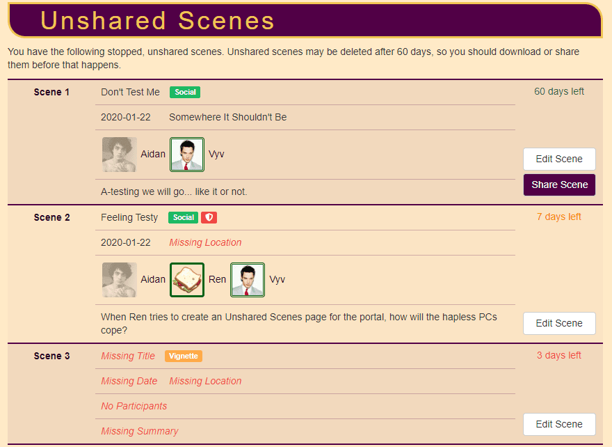

# Plugin Title

## Credits

Contributed by Ren@AresCentral

## Overview

Adds an Unshared Scenes page, with details on each scene you have rights over which is stopped but not yet shared. It gives an immediate overview of what needs setting in order for the scene to be sharable, with links directly to the page to edit your scene, and if the scene has everything set, allows you to share it directly from the list. If the game has a deletion time set for unshared logs, this also lists how many days before a given scene will be deleted.

## Web Portal

This plugin is almost entirely a web portal addition. It adds one page.

## Installation

In the game, run `plugin/install unshared`.

You'll also need to go to `/ares-webportal/app/router.js` and edit:

    this.route('scenes-live');
    this.route('scenes-play');
  
to:
  
    this.route('scenes-live');
    this.route('scenes-unshared');
    this.route('scenes-play');

You'll probably also want to add the page to your navigation somewhere. To do this, go to `Admin > Setup > website.yml` and find `top_navbar`. If you have the default configuration, one reasonable option is to change:

    - title: My Scenes
      route: scenes-play
    - title: Start New Scene
      route: scene-create
      
to:
      
    - title: My Scenes
      route: scenes-play
    - title: Unshared Scenes
      route: scenes-unshared
    - title: Start New Scene
      route: scene-create

## Configuration

This plugin has no configuration options. 

## Uninstalling

Removing the plugin requires some code fiddling.  See [Uninstalling Plugins](https://www.aresmush.com/tutorials/code/extras.html#uninstalling-plugins).
